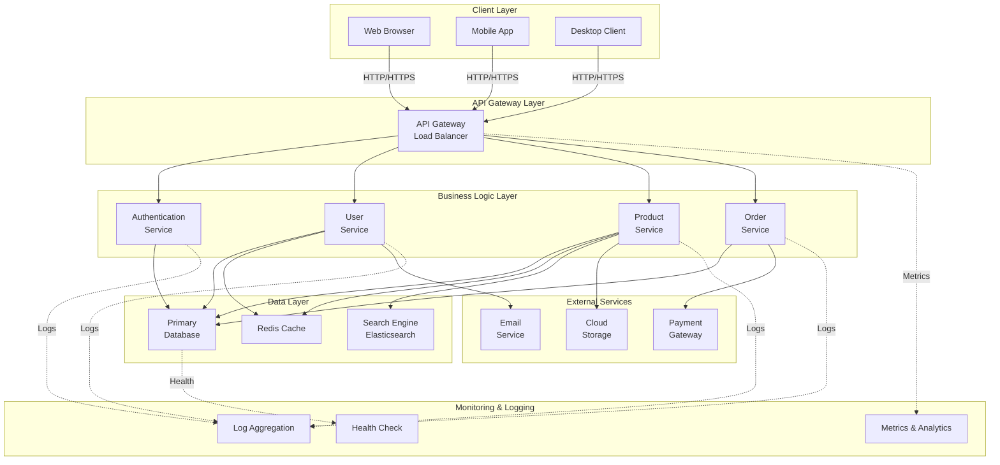

# Architecture Overview

This document provides a visual overview of the system architecture using a multi-tier design pattern.

## System Architecture Diagram

## Architecture Layers

### 1. **Client Layer**
- **Web Browser**: Traditional web interface
- **Mobile App**: Native or cross-platform mobile application
- **Desktop Client**: Desktop application for advanced users

### 2. **API Gateway Layer**
- **API Gateway & Load Balancer**: 
  - Single entry point for all client requests
  - Handles request routing and load balancing
  - Manages authentication tokens
  - Rate limiting and request validation

### 3. **Business Logic Layer**
Microservices handling core business operations:
- **Authentication Service**: User login, registration, token management
- **User Service**: User profile management and preferences
- **Product Service**: Product catalog and inventory management
- **Order Service**: Order processing and management

### 4. **Data Layer**
- **Primary Database**: Stores all persistent data (relational database like PostgreSQL/MySQL)
- **Redis Cache**: In-memory caching for frequently accessed data
- **Search Engine**: Elasticsearch for advanced search capabilities

### 5. **External Services**
- **Payment Gateway**: Third-party payment processing
- **Email Service**: Transactional email sending
- **Cloud Storage**: File and media storage (AWS S3, Azure Blob, etc.)

### 6. **Monitoring & Logging**
- **Log Aggregation**: Centralized logging (ELK Stack, Splunk)
- **Metrics & Analytics**: Performance monitoring and dashboards
- **Health Check**: System health monitoring and alerts

## Key Features

- ✅ **Scalability**: Independent scaling of each tier
- ✅ **Separation of Concerns**: Each layer has distinct responsibilities
- ✅ **Resilience**: Load balancing and caching improve reliability
- ✅ **Maintainability**: Modular microservices are easier to update
- ✅ **Observability**: Comprehensive logging and monitoring
- ✅ **Security**: API Gateway provides centralized security controls

## Data Flow

1. Client sends request → API Gateway
2. Gateway routes to appropriate microservice
3. Service processes request and queries database/cache
4. Response returned through gateway to client
5. All operations logged for monitoring and debugging
